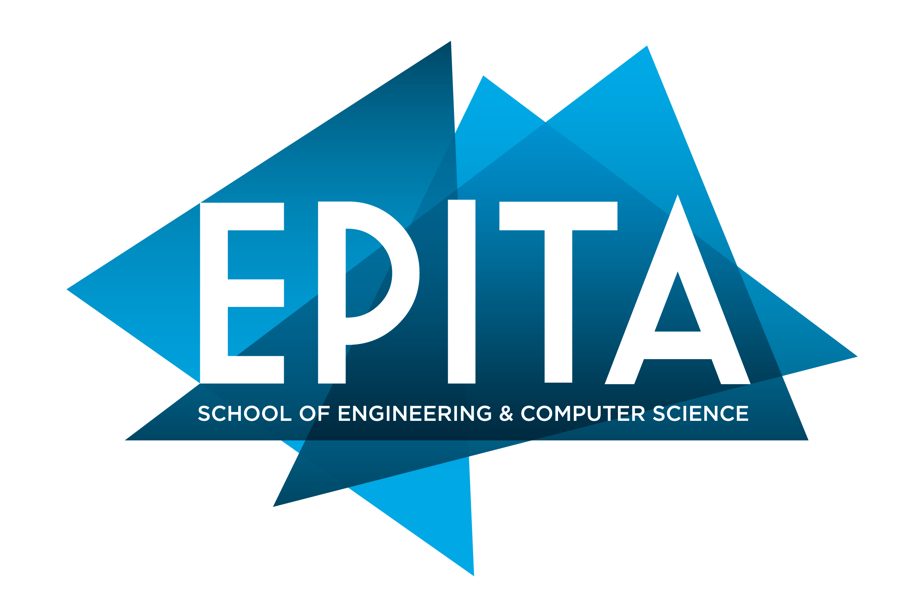
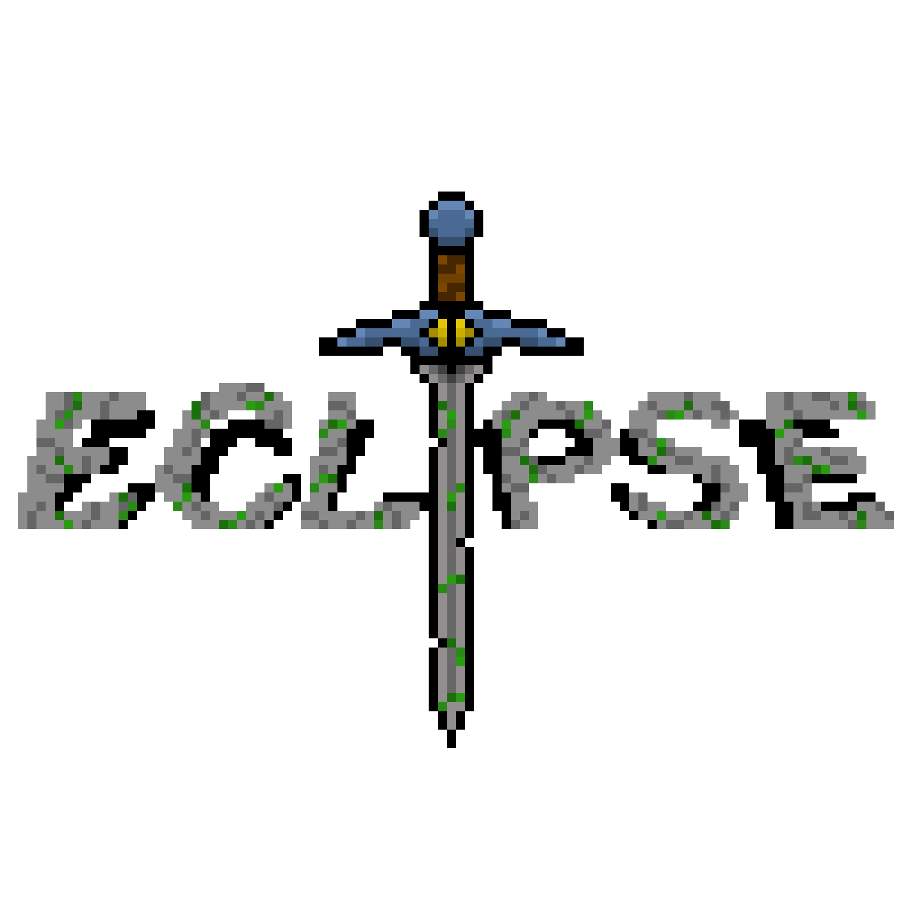
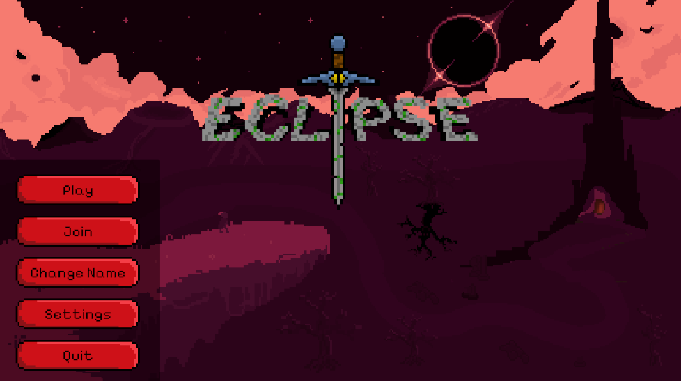

# Portfolio – Elouan Hubert

**Étudiant en Prépa Informatique à l’EPITA**  
elouan.hubert@epita.fr  
Encadrant : Mr Kabous  
Année 2025  

---

## Sommaire
- [1. Introduction](#1-introduction)
- [2. Présentation personnelle](#2-présentation-personnelle)
- [3. Parcours académique](#3-parcours-académique)
- [4. Projets réalisés](#4-projets-réalisés)
  - [4.1 Project Eclipse](#41-project-eclipse)
- [5. Projets en cours](#5-projets-en-cours)
  - [5.1 Project OCR](#51-project-ocr)
- [6. Expériences professionnelles](#6-expériences-professionnelles)
- [7. Compétences et savoir-faire](#7-compétences-et-savoir-faire)
  - [7.1 Compétences techniques (Hard Skills)](#71-compétences-techniques-hard-skills)
  - [7.2 Compétences méthodologiques](#72-compétences-méthodologiques)
  - [7.3 Compétences comportementales (Soft Skills)](#73-compétences-comportementales-soft-skills)
- [8. Ouverture et perspectives](#8-ouverture-et-perspectives)
- [9. Conclusion](#9-conclusion)

---

## 1. Introduction

Ce portfolio présente mon parcours académique, mes expériences et les compétences que j’ai développées durant ma formation à l’EPITA.  
Il illustre ma progression dans le domaine de l’informatique ainsi que mes aspirations pour la suite de mon parcours.

---

## 2. Présentation personnelle

Je m'appelle **Elouan Hubert**, actuellement étudiant en cycle préparatoire à l’**EPITA**.  
Passionné par l’informatique, j’aime apprendre, expérimenter et relever des défis techniques.  
Mon objectif est de développer un large éventail de compétences pour évoluer dans le domaine du développement logiciel.

---

## 3. Parcours académique

**EPITA – École pour l'Informatique et les Techniques Avancées**  
Cycle préparatoire – formation orientée vers l’informatique et les sciences fondamentales, avec une approche à la fois **théorique et pratique**.

---

## 4. Projets réalisés

### 4.1 Project Eclipse

**Type :** Jeu vidéo 2D roguelike multijoueur  
**Technologies :** Unity, C#, Git  

**Description :**  
Projet Eclipse est un jeu vidéo 2D de type roguelike, réalisé en première année.  
L’objectif était d’apprendre à travailler en groupe et à concevoir un jeu vidéo multijoueur.

**Rôle personnel :**
- Génération aléatoire des niveaux  
- Design 2D et animation  
- Comportement des ennemis  

---

## 5. Projets en cours

### 5.1 Project OCR

**Type :** Projet d’analyse d’image et d’intelligence artificielle  
**Technologies :** C, SDL, Réseau neuronal  

**Objectif :**  
Résoudre une grille de mots cachés à partir d’une photo grâce à un réseau neuronal et un algorithme de reconnaissance de caractères (OCR).

**Rôle personnel :**
- Développement du backend  
- Algorithme de résolution de grille  
- Génération des coordonnées des mots trouvés  

---

## 6. Expériences professionnelles

**Poste :** Employé polyvalent – McDonald’s (CDI)  

**Responsabilités :**
- Gestion des commandes et respect des procédures d’hygiène  
- Travail d’équipe en période de forte affluence  
- Gestion du stress et adaptation rapide  

**Compétences acquises :**
- Communication et esprit d’équipe  
- Gestion du temps et priorisation  
- Rigueur et ponctualité  

---

## 7. Compétences et savoir-faire

### 7.1 Compétences techniques (Hard Skills)

**Langages :**  
C, Python, C#, Assembleur  

**Paradigmes :**  
Procédural, orienté objet  

**Systèmes :**  
Linux (gestion de la mémoire, des processus, du multitâche)  

**Outils :**  
Git, VSCode, VIM  

---

### 7.2 Compétences méthodologiques

- Gestion de projet en équipe  
- Planification et répartition des tâches  
- Suivi de l’avancement  
- Rédaction de documentation technique claire et précise  
- Communication au sein d’un groupe  

---

### 7.3 Compétences comportementales (Soft Skills)

- Autonomie et sens de l’initiative  
- Créativité et rigueur  
- Curiosité intellectuelle  
- Esprit critique et adaptabilité  

---

## 8. Ouverture et perspectives

Mon parcours à l’EPITA m’a permis de découvrir de nombreux aspects de l’informatique.  
Je souhaite approfondir mes connaissances dans :
- L’automatisation  
- La cybersécurité  
- Le développement logiciel à grande échelle  

À court terme, je souhaite continuer à développer mes compétences techniques à travers des projets concrets, des stages et des expériences en entreprise.  
À long terme, mon objectif est de devenir **ingénieur en informatique**, capable de contribuer à des projets ambitieux et innovants.

---

## 9. Conclusion

Ce portfolio témoigne de mon parcours, de mes réalisations et de ma progression à l’EPITA.  
Il illustre ma passion pour l’informatique et mon engagement à évoluer dans ce domaine.

---

**Contact :**  
[elouan.hubert@epita.fr](mailto:elouan.hubert@epita.fr)  
[GitHub – Elouan Hubert](https://github.com/ElouanHubert)
<!--
**Elouan82/Elouan82** is a ✨ _special_ ✨ repository because its `README.md` (this file) appears on your GitHub profile.

Here are some ideas to get you started:

- 🔭 I’m currently working on ...
- 🌱 I’m currently learning ...
- 👯 I’m looking to collaborate on ...
- 🤔 I’m looking for help with ...
- 💬 Ask me about ...
- 📫 How to reach me: ...
- 😄 Pronouns: ...
- ⚡ Fun fact: ...
-->
